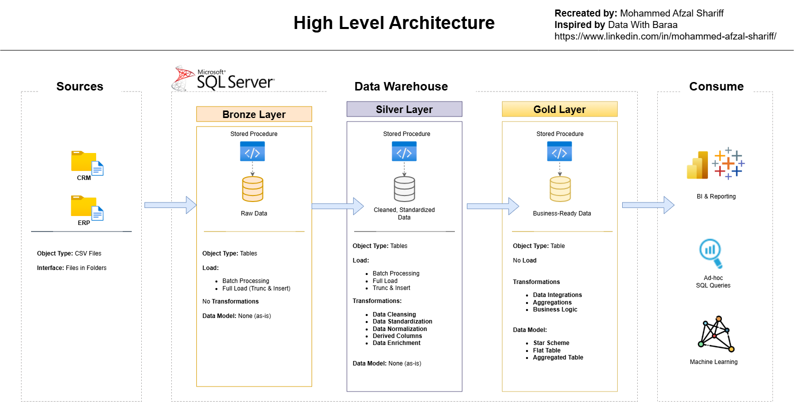

# 🏢 SQL Data Warehouse Project

## Enterprise SQL Server Data Warehouse with Layered ETL & Analytics

Welcome to the **SQL Data Warehouse Project** repository.  
This project demonstrates the **design and implementation of an enterprise-grade SQL Server data warehouse**, covering the full lifecycle from raw data ingestion to analytics-ready data models.

The solution follows **industry best practices** in data engineering, ETL design, and dimensional modeling, and is intended as a **portfolio project showcasing real-world data warehouse architecture**.

---

## 🏗️ Data Architecture

The project is designed using a **Medallion Architecture (Bronze–Silver–Gold)** approach:



### Architecture Layers

- **Bronze Layer (Raw)**  
  Ingests raw data from source systems (ERP & CRM) in CSV format into SQL Server with minimal transformation.

- **Silver Layer (Cleansed)**  
  Applies data cleansing, standardization, and business rules to prepare high-quality, consistent data.

- **Gold Layer (Analytics)**  
  Delivers business-ready datasets modeled using **star schema** (fact & dimension tables) optimized for reporting and analytics.

---

## 📖 Project Overview

This project covers the following key areas:

1. **Data Architecture Design**  
   - Modern SQL Server data warehouse using layered architecture  
   - Clear separation of ingestion, transformation, and analytics layers  

2. **ETL Pipelines**  
   - End-to-end SQL-based ETL workflows  
   - Data quality handling and transformations  

3. **Data Modeling**  
   - Fact and dimension table design  
   - Star schema optimized for analytical workloads  

4. **Analytics & Reporting**  
   - SQL-driven business insights  
   - KPIs and trend analysis for decision support  

🎯 This repository demonstrates hands-on expertise in:
- SQL Development  
- Data Warehousing  
- Data Engineering  
- ETL Design  
- Dimensional Modeling  
- Business Analytics  

---

## 🛠️ Tools & Technologies

- **SQL Server** – Data warehouse platform  
- **SQL Server Management Studio (SSMS)** – Development & administration  
- **Draw.io** – Architecture, data flow, and data model diagrams  
- **Git & GitHub** – Version control and project management  

---

## 🚀 Project Objectives

### Data Engineering

**Objective**  
Design and build a scalable SQL Server data warehouse to consolidate sales data from multiple source systems for analytics and reporting.

**Key Requirements**
- Multiple source systems (ERP & CRM)  
- Data cleansing and quality handling  
- Unified analytical data model  
- Latest snapshot reporting (no historization)  
- Clear documentation for technical and business users  

---

### Analytics & Reporting

**Objective**  
Enable business insights through SQL-based analytics, including:

- Customer behavior analysis  
- Product performance evaluation  
- Sales trend analysis  

These insights support **data-driven decision-making** across business stakeholders.

---

## 📂 Repository Structure

```
sql-data-warehouse-project/
│
├── datasets/ # Source data (ERP & CRM CSV files)
│
├── docs/ # Architecture & documentation
│ ├── data_architecture.drawio
│ ├── data_flow.drawio
│ ├── data_models.drawio
│ ├── data_catalog.md
│ └── naming_conventions.md
│
├── scripts/ # SQL scripts
│ ├── bronze/ # Raw data ingestion
│ ├── silver/ # Data cleansing & transformations
│ └── gold/ # Analytics-ready models
│
├── tests/ # Data validation & quality checks
│
├── README.md
├── LICENSE
└── .gitignore
```


---

## 🧠 Key Takeaways

- Demonstrates **end-to-end data warehouse design**
- Uses **real-world enterprise patterns**
- Focuses on **clarity, scalability, and analytics performance**
- Designed as a **production-style portfolio project**

---

## 👤 About the Author

**Mohammed Afzal Shariff**  
BI & Analytics Associate Manager | Data Engineering | SQL | Power BI | Databricks  

📍 Bengaluru, India  

This project is part of my professional portfolio, showcasing practical experience in designing and delivering enterprise analytics solutions.

---

## 🛡️ License

This project is licensed under the **MIT License**.  
Feel free to use, modify, and adapt with proper attribution.
